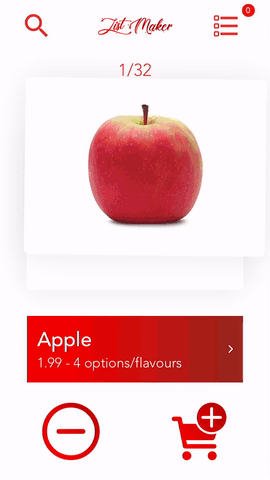
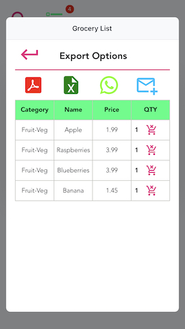
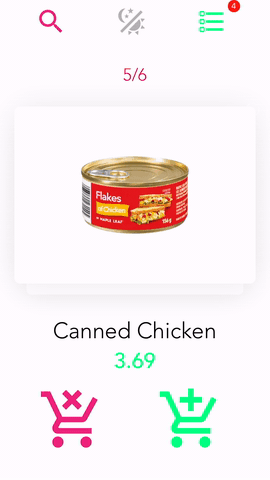
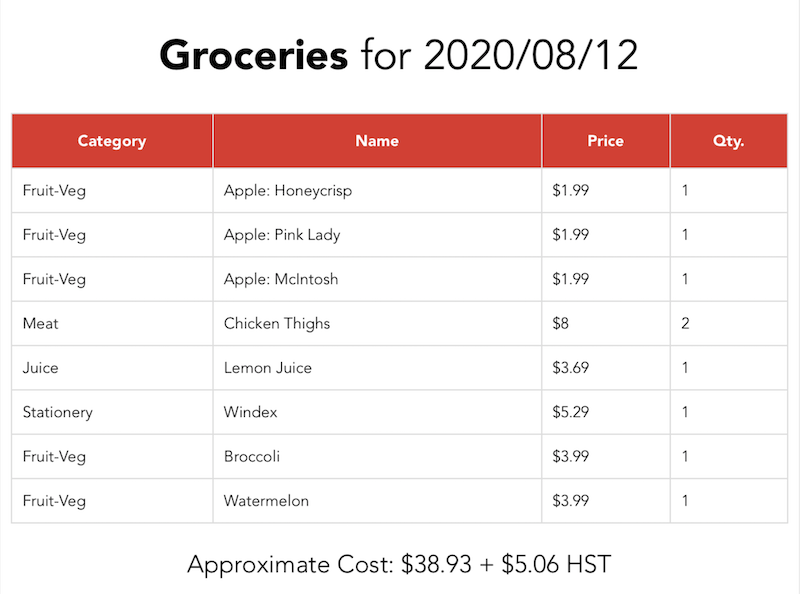

 
----------------------------------

  

## iOS Download (TestFlight): https://testflight.apple.com/join/sPEu4v8P
## Demo Video: https://www.youtube.com/watch?v=ASktNijdeEI

# Simplified grocery list generator:
 - Grocery items are arranged as cards which can be swiped left or right
 - Swiping a card to the right adds the product to the list, swiping left discards it
    - Tap on the card to adjust the quantity before adding it to the list
## Quick-add Menu
 - Tapping the icon in the top-left reveals a scrollable list of products which can be filtered using the search bar
 - Tapping on a product reveals a popup menu which gives more information on the product, options to select the quantity, as well as a button to add it to the list
 - Where applicable, the menu includes options to specify characteristics such as flavour or container size.
## List View and Export Menu
 - Tap the icon in the top-right to view the complete list of selected grocery items
 - Tapping the top right button will toggle between "table" and "card" views
 - Tapping on the red shopping cart icon next to an item removes it from the list
 - Options are given to export the list as a PDF, Excel spreadsheet, or E-mail/SMS message
 
 #### Here is a sample PDF generated by ListMaker:
 
 
 # Settings
 - Tap the "ListMaker" logo at the top to reveal the settings menu:
 ### Barcode Scanner
 - Add a missing item to the list using the built-in Barcode Scanner (Expo).
 - The scanned UPC code is used to quickly retrieve the product data and add it to the list
 ### Dark Mode
  - The app can be switched between light and dark mode
 ### Reset Card index
 - Resets the card deck to the first item
 ### Clear Grocery List
 - Remove all selected items and restart with an empty list
 # Installation
 View/Test the app here: https://expo.io/@/ListMaker
    
  (Product data is taken from various grocery stores in Ottawa)
