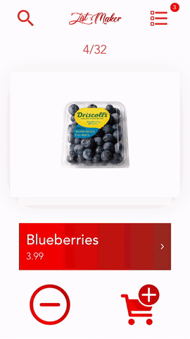

 
----------------------------------

  

# Simplified grocery list generator:
 - Grocery Products are arranged as cards which can be swiped left or right
 - Swiping a card to the right adds the product to the list, swiping left discards it
    - Tap on the card to adjust the quantity before adding it to the list
## Quick-add Menu
 - Tapping the icon in the top-left reveals a scrollable list of products which can be filtered using the search bar
 - Tapping on a product reveals a popup menu which gives more informationon the product, as well as a button to add it to the list
## List View and Export Menu
 - Tap the icon in the top-right to view the complete list of selected grocery items
 - Options are given to export the list as a PDF, Excel spreadsheet, or E-mail message
    - Tapping on the red shopping cart icon next to an item removes it from the list
 ## Dark Mode
  - The app can be switched between light and dark mode
  
 View/Test the app here: https://expo.io/@/ListMaker
    
  (Product data is taken from various grocery stores in Ottawa)
